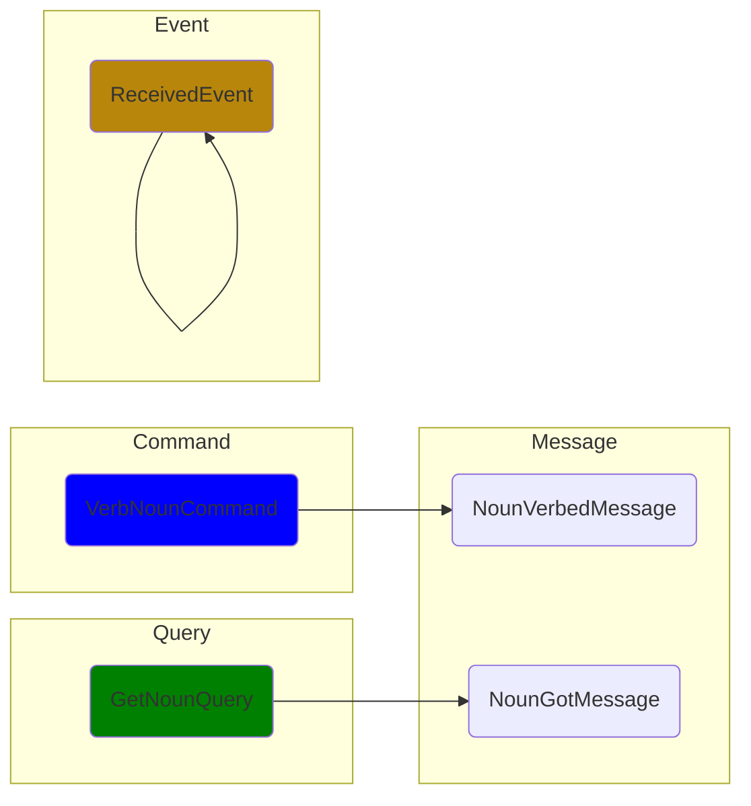
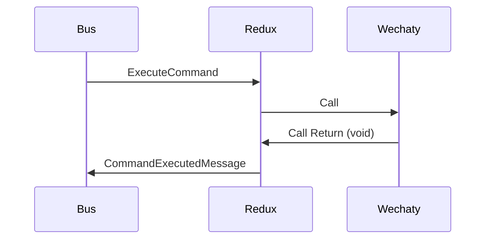
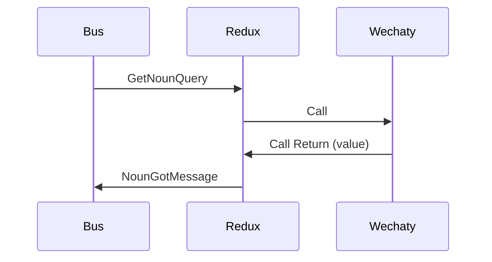
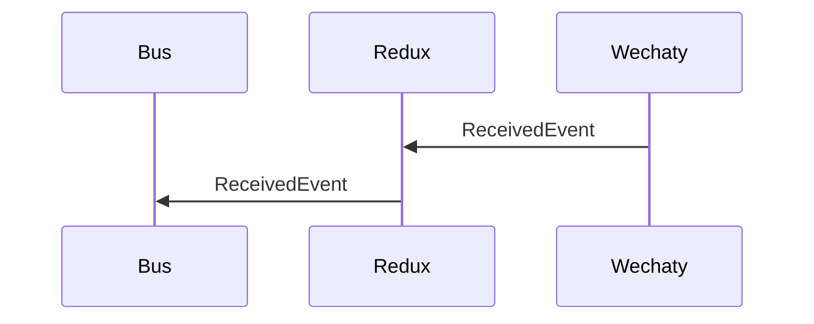

# CQRS Wechaty

[](https://www.npmjs.com/package/wechaty-cqrs)
[](https://github.com/wechaty/cqrs/actions?query=workflow%3ANPM)
[](https://github.com/huan/ducks#3-ducksify-extension-currying--api-interface)
[](https://github.com/Chatie/tsconfig/issues/16)

A event-driven architecture wrapper for Wechaty
that applies the CQS principle
by using separate Query and Command messages
to retrieve and modify the bot state,
respectively.


> Image source: [Introducing Derivative Event Sourcing](https://www.confluent.io/blog/event-sourcing-vs-derivative-event-sourcing-explained/)

## Command Query Responsibility Separation (CQRS)

> Command query responsibility separation (CQRS) generalises CQS
  to message-driven and event-driven architectures:
  it applies the CQS principle by using separate Query and Command messages
  to retrieve and modify data, respectively.
>
> &mdash; [Wikipedia: Command–query separation](https://en.wikipedia.org/wiki/Command%E2%80%93query_separation)


> Image source: [CQRS (command query responsibility segregation)](https://www.techtarget.com/searchapparchitecture/definition/CQRS-command-query-responsibility-segregation)

## Usage

### Install

```sh
npm install wechaty-cqrs wechaty
```

### Quick start

Here's the CQRS version of the Wechaty ding/dong bot:

```ts
import * as WECHATY from 'wechaty'
import * as CQRS    from 'wechaty-cqrs'

import { filter }   from 'rxjs/operators'

const wechaty = WECHATY.WechatyBuilder.build()
await wechaty.init()

const bus$ = CQRS.bus(wechaty)

bus$.pipe(
  filter(CQRS.isActionOf(CQRS.events.messageReceivedEvent)),
  filter(event => event.payloads.type === CQRS.sayable.type.Text),
  filter(event => event.payloads.payload === 'ding')
).subscribe(ding => bus$.next(
  CQRS.commands.sendMessage(
    ding.payload.talkerId,
    CQRS.sayable.text('dong'),
  ),
))

await wechaty.start()
```

## Diagrams




### Command



### Query



### Event



## API Docs

TBW

## Resources

- [class-transformer](https://github.com/typestack/class-transformer) -
  Decorator-based transformation, serialization, and deserialization
  between objects and classes.

## History

### main v0.4 (Mar 13, 2022)

CQRS Ding/Dong BOT works as expected.

### v0.2 (Mar 11, 2022)

Unit tests all passed, DevOps enabled.

### v0.0.1 (Mar 6, 2022)

Init README & Draft design.

## Author

[Huan LI](https://github.com/huan)
([李卓桓](http://linkedin.com/in/zixia)),
[Microsoft Regional Director](https://rd.microsoft.com/en-us/huan-li),
<zixia@zixia.net>

[](https://stackexchange.com/users/265499)

## Copyright & License

- Code & Docs © 2022 Huan (李卓桓) \<zixia@zixia.net\>
- Code released under the Apache-2.0 License
- Docs released under Creative Commons
