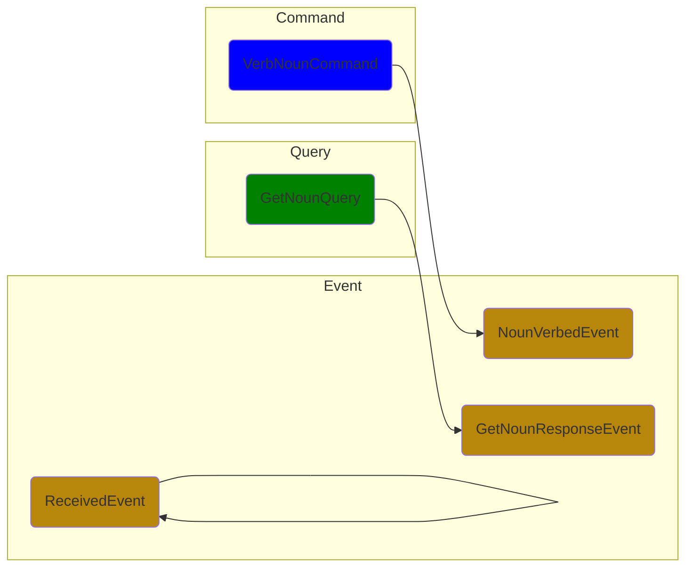

# CQRS Wechaty

A event-driven architecture wrapper for Wechaty that applies the CQS principle by using separate Query and Command messages to retrieve and modify the bot state, respectively.

> Image source: [Introducing Derivative Event Sourcing](https://www.confluent.io/blog/event-sourcing-vs-derivative-event-sourcing-explained/)

## Command Query Responsibility Separation (CQRS)

> Command query responsibility separation (CQRS) generalises CQS to message-driven and event-driven architectures: it applies the CQS principle by using separate Query and Command messages to retrieve and modify data, respectively.
>
> &mdash; [Wikipedia: Command–query separation](https://en.wikipedia.org/wiki/Command%E2%80%93query_separation)

> Image source: [CQRS (command query responsibility segregation)](https://www.techtarget.com/searchapparchitecture/definition/CQRS-command-query-responsibility-segregation)

## Diagrams

### Command

### Query

### Event

## Resources

- [class-transformer](https://github.com/typestack/class-transformer) - Decorator-based transformation, serialization, and deserialization between objects and classes.

## Author

[Huan LI](https://github.com/huan) ([李卓桓](http://linkedin.com/in/zixia)), [Microsoft Regional Director](https://rd.microsoft.com/en-us/huan-li), <zixia@zixia.net>

## Copyright & License

- Code & Docs © 2022 Huan (李卓桓) \<zixia@zixia.net\>
- Code released under the Apache-2.0 License
- Docs released under Creative Commons
