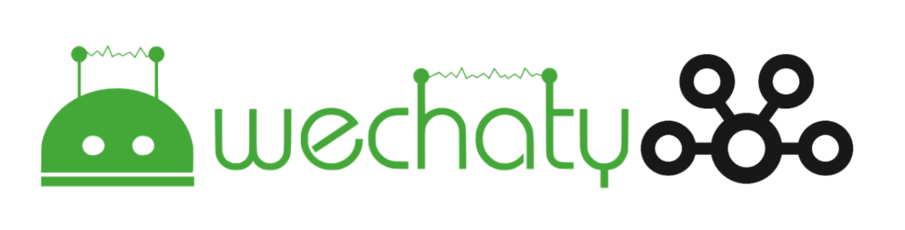
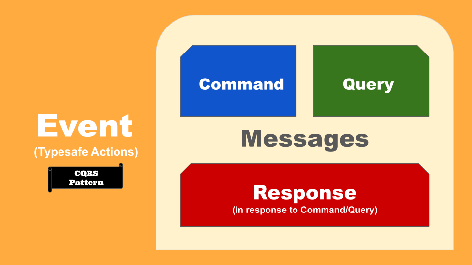
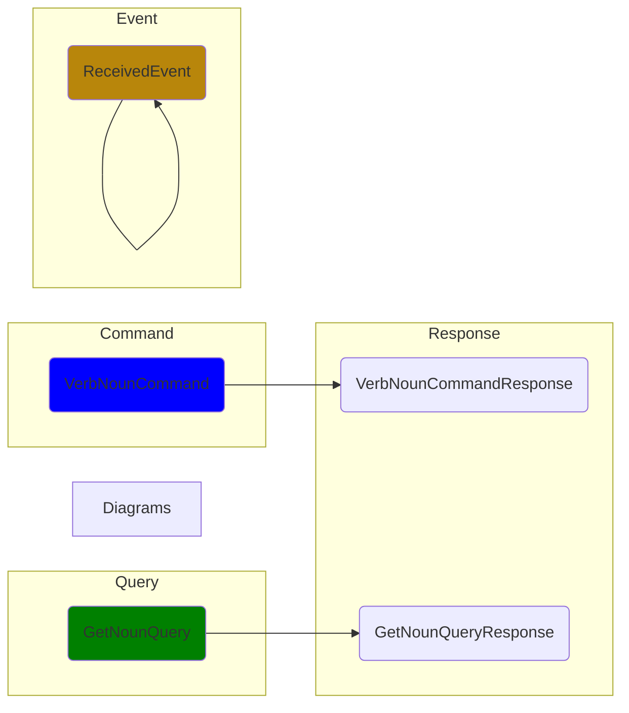

# CQRS Wechaty

[](https://www.npmjs.com/package/wechaty-cqrs)
[](https://github.com/wechaty/cqrs/actions?query=workflow%3ANPM)
[](https://github.com/huan/ducks#3-ducksify-extension-currying--api-interface)
[](https://github.com/Chatie/tsconfig/issues/16)

An event-driven architecture wrapper for Wechaty
that applies the CQS principle
by using separate Query and Command messages
to retrieve and modify the bot state,
respectively.



> Image source: [Introducing Derivative Event Sourcing](https://www.confluent.io/blog/event-sourcing-vs-derivative-event-sourcing-explained/)

## Command Query Responsibility Separation (CQRS)

> Command query responsibility separation (CQRS) generalises CQS
  to message-driven and event-driven architectures:
  it applies the CQS principle by using separate Query and Command messages
  to retrieve and modify data, respectively.
>
> &mdash; [Wikipedia: Command–query separation](https://en.wikipedia.org/wiki/Command%E2%80%93query_separation)


> Image source: [CQRS (command query responsibility segregation)](https://www.techtarget.com/searchapparchitecture/definition/CQRS-command-query-responsibility-segregation)

## Motivation

Can we use Wechaty by only sending / receiving the [Plain Old JavaScript Object (POJO)](https://masteringjs.io/tutorials/fundamentals/pojo)?

That's an Event-driven way, which will give us the following benifites:

1. Better integration with Domain-driven Design (DDD)
1. Decouple the sub-systems with the Wechaty instance completely
1. Enable using Wechaty with Microservices
1. Make it possible for providing an API endpoint with JSON request/responses
1. etc.

So we decided to support the  Event-driven Architecture
by enabling the Event-driven Programming with Wechaty
by publishing the [wechaty-cqrs](https://npmjs.com/package/wechaty-cqrs) NPM module.

## Features

1. Convert Wechaty instance to a messaging `bus$` with the `from()` function.
1. Well-defined `commands`, `queries`, `responses`, and `events` payload creators.
1. A great `execute$()` helper function for sending the events
  to the bus and get back the response.
1. Well-defined `events$` for the Wechaty events
1. Well-defined `sayables` for build all the message contents
1. Static typing with TypeScript with all events & streams
1. Working perfect with the powerful RxJS

## Usage

### Install

```sh
npm install wechaty-cqrs wechaty
```

### Quick start

Here's the CQRS version of the Wechaty bot usage:

```ts
import * as CQRS    from 'wechaty-cqrs'
import * as WECHATY from 'wechaty'
import { filter, map, mergeMap }  from 'rxjs/operators'

const wechaty = WECHATY.WechatyBuilder.build()
await wechaty.init()

const bus$ = CQRS.from(wechaty)

bus$.pipe(
  filter(CQRS.is(CQRS.events.MessageReceivedEvent)),
  // MessageReceivedEvent -> Sayable
  map(messageId => CQRS.queries.GetSayablePayloadQuery(
    messageReceivedEvent.meta.puppetId,
    messageId,Diagrams
  )),
  mergeMap(CQRS.execute$(bus$)),
  // Log `sayable` to console
).subscribe(sayable =>
  console.info('Sayable:', sayable),
)

bus$.next(CQRS.commands.StartCommand(wechaty.puppet.id))
```

Learn how to build a Ding Dong BOT with CQRS from our [examples/ding-dong-bot.ts](https://github.com/wechaty/cqrs/blob/main/examples/ding-dong-bot.ts)

## Getting Started

Here's a video introduction for CQRS Wechaty with live demo, presented by Huan:

[](https://youtu.be/kauxyPVa0jo)

> YouTube: <https://youtu.be/kauxyPVa0jo>

The getting started [ding-dong-bot.ts](https://github.com/wechaty/getting-started/blob/main/examples/cqrs/ding-dong-bot.ts)
in the video: <https://github.com/wechaty/getting-started/blob/main/examples/cqrs/ding-dong-bot.ts>

## Architecture Diagrams





### Command


### Query


### Event


## API Reference

Read CQRS Wechaty API Reference at: <https://paka.dev/npm/wechaty-cqrs>

## Blogs

- [Refactoring Friday BOT with NestJS, Domain-driven Design (DDD), and CQRS, @huan, Feb 27, 2022](https://wechaty.js.org/2022/02/27/refactoring-friday-bot-with-nestjs-ddd-cqrs/)

## Resources

- [Layers in DDD microservices](https://docs.microsoft.com/en-us/dotnet/architecture/microservices/microservice-ddd-cqrs-patterns/ddd-oriented-microservice#layers-in-ddd-microservices)
- Effective Aggregate Design
  - [Part I: Modeling a Single Aggregate](https://www.dddcommunity.org/wp-content/uploads/files/pdf_articles/Vernon_2011_1.pdf)
  - [Part II: Making Aggregates Work Together](https://www.dddcommunity.org/wp-content/uploads/files/pdf_articles/Vernon_2011_2.pdf)
  - [Part III: Gining Insight Through Discovery](https://www.dddcommunity.org/wp-content/uploads/files/pdf_articles/Vernon_2011_3.pdf)
- [Domain-Application-Infrastructure Services pattern](https://badia-kharroubi.gitbooks.io/microservices-architecture/content/patterns/tactical-patterns/domain-application-infrastructure-services-pattern.html)

## History

### main v1.12 (Mar 27, 2022)

1. Classify action builders so that they will be compatible with Class events
  with NestJS [#1](https://github.com/wechaty/cqrs/issues/1)
1. `execute$()` helper function for sending the events to the bus
  and get back the response, with automatically type inferring.
1. lots of typing enhancements.

Learn more from [PR #3](https://github.com/wechaty/cqrs/pull/3)

## v0.10 (Mar 17) Beta release

- v0.9 (Mar 17,2022): Refactoring(clean) module exports
- v0.7 (Mar 16, 2022): Refactoring `execute$` with `duck.actions` builders.
- v0.6 (Mar 13, 2022): Alpha release.
- v0.4 (Mar 13, 2022): CQRS Ding/Dong BOT works as expected.
- v0.2 (Mar 11, 2022): Unit tests all passed, DevOps enabled.
- v0.0.1 (Mar 6, 2022): Init README & Draft design.

## Author

[Huan LI](https://github.com/huan)
([李卓桓](http://linkedin.com/in/zixia)),
[Microsoft Regional Director](https://rd.microsoft.com/en-us/huan-li),
<zixia@zixia.net>

[](https://stackexchange.com/users/265499)

## Copyright & License

- Code & Docs © 2022 Huan (李卓桓) \<zixia@zixia.net\>
- Code released under the Apache-2.0 License
- Docs released under Creative Commons
